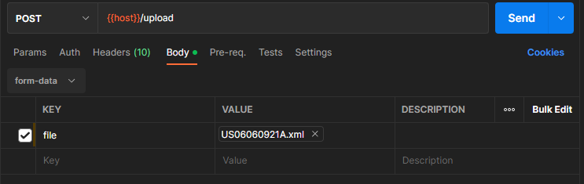

# basf-challenge

## SETUP

#### Database: ``MongoDB`` ``in case you have Docker in your local yor can use the Docker-Compose file in the directory`` [docker-compose.yml](mongodb/docker-compose.yml)

(This will set the necessary persistent database for the correct functioning)

* MONGO_INITDB_ROOT_USERNAME: **root**
* MONGO_INITDB_ROOT_PASSWORD: **secret**

## REQUIREMENTS

- **Java17+** ``language level``
- **MongoDB** ``database``
- **Postman** ``enpoint testing`` *~ se below the necessary files to import:*

  * [ENVIRONMENT](postman/BASF.postman_environment.json)
  * [COLLECTIONS](postman/BASF CHALLENGE ENDPOINTS.postman_collection.json)

For process a xml Patent use this configuration in Postman *~ This sets a Multipart file needed for process:*

    

